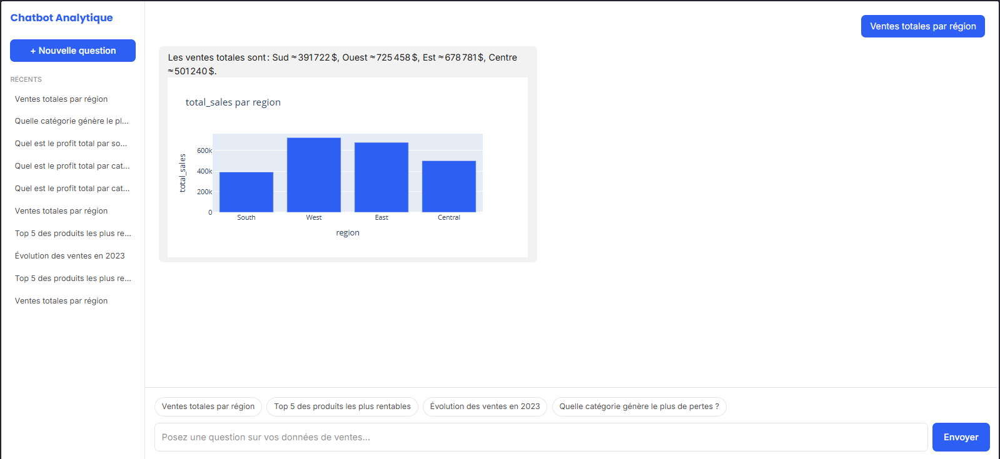
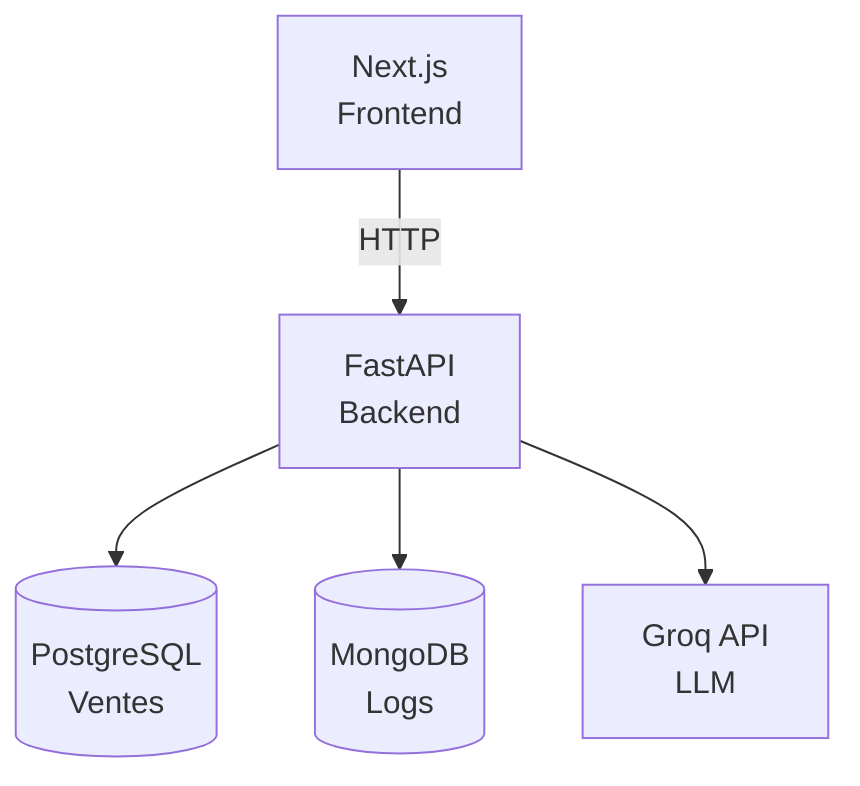

# Chatbot Analytique

**Version 1.0**

Un chatbot qui répond en langage naturel à des questions sur des données de ventes, en générant à la fois une réponse textuelle et un graphique — un système "Text-to-SQL conversationnel" combinant NLP, data science et architecture applicative complète.

> Pose une question comme *"Quelles sont les ventes totales par région ?"*, le système génère la requête SQL correspondante, l'exécute, produit un graphique, et répond en français — le tout de façon sécurisée.

## Fonctionnalités

- **Question en langage naturel → SQL** via un LLM (Groq / Llama)
- **Validation de sécurité** du SQL généré (SELECT uniquement, mots-clés dangereux filtrés, timeout d'exécution)
- **Graphique généré dynamiquement** (Plotly) à partir du résultat réel de la requête, avec code couleur sémantique (rouge = valeurs négatives)
- **Réponse reformulée en langage naturel**, factuelle et sans hallucination de chiffres
- **Historique des questions** persistant (MongoDB), affiché en temps réel dans l'interface
- **Interface de chat** complète (Next.js), avec suggestions de questions types

## Démo



## Architecture




**Flux d'une requête :**

1. L'utilisateur pose une question dans l'interface Next.js
2. FastAPI construit un prompt (question + schéma de la table) et appelle Groq pour générer du SQL
3. Le SQL généré est validé (SELECT uniquement, aucun mot-clé destructeur, une seule instruction)
4. La requête est exécutée sur PostgreSQL, avec un timeout de sécurité (5s) et un utilisateur en lecture seule
5. Le résultat est transformé en graphique Plotly (JSON)
6. Groq reformule le résultat en réponse en langage naturel
7. La requête (question, SQL, résultat, réponse) est loguée dans MongoDB
8. La réponse complète (texte + graphique) est renvoyée au frontend et affichée

## Stack technique

| Brique | Technologie |
|---|---|
| Frontend | Next.js 15 (App Router), TypeScript, Tailwind CSS v4 |
| Backend | FastAPI, SQLAlchemy |
| Base de données analytique | PostgreSQL |
| Base de données historique | MongoDB |
| LLM | Groq (Llama / GPT-OSS) |
| Graphiques | Plotly |
| Conteneurisation | Docker, Docker Compose |

## Dataset

[Superstore Sales Dataset](https://www.kaggle.com/) (Kaggle) — 9 994 lignes de données de ventes (région, catégorie de produit, segment client, ventes, quantité, remise, profit).

## Sécurité

Le Text-to-SQL pose un risque réel si mal encadré — plusieurs couches de protection sont mises en place :

- **Utilisateur PostgreSQL en lecture seule** (permissions restreintes à `SELECT`)
- **Validation du SQL généré** avant exécution : doit commencer par `SELECT`, une seule instruction autorisée, mots-clés dangereux filtrés (`DROP`, `DELETE`, `UPDATE`, `INSERT`, `ALTER`, `TRUNCATE`...)
- **Timeout d'exécution** (`statement_timeout`) pour éviter qu'une requête mal optimisée ne bloque des ressources
- **CORS restreint** : le backend n'autorise que l'origine du frontend, pas `*`

## Installation

### Avec Docker (recommandé)

Prérequis : Docker et Docker Compose installés.

```bash
git clone https://github.com/<ton-username>/chatbot-analytique.git
cd chatbot-analytique
cp .env.example .env
cp backend/.env.example backend/.env
```

Renseigne tes propres valeurs dans `backend/.env` (notamment `GROQ_API_KEY`, à obtenir gratuitement sur [console.groq.com](https://console.groq.com)).

```bash
docker-compose up -d --build
```

Charge le dataset dans PostgreSQL :

```bash
docker exec -it chatbot_backend python scripts/load_data.py
```

L'application est accessible sur [http://localhost:3000](http://localhost:3000), l'API sur [http://localhost:8000/docs](http://localhost:8000/docs).

### En développement local (sans Docker pour le code applicatif)

**Backend :**

```bash
cd backend
python -m venv venv
venv\Scripts\activate  # Windows
pip install -r requirements.txt
```

Lance PostgreSQL et MongoDB via Docker uniquement :

```bash
docker-compose up -d postgres mongodb
```

```bash
python scripts/load_data.py
uvicorn app.main:app --reload
```

**Frontend :**

```bash
cd frontend
npm install
npm run dev
```

## Structure du projet

```
chatbot-analytique/
├── backend/
│   ├── app/
│   │   ├── core/       # Configuration, logging
│   │   ├── db/         # Connexions PostgreSQL/MongoDB
│   │   ├── models/     # Modèles ORM et Pydantic
│   │   ├── schemas/    # Contrats d'API
│   │   ├── api/        # Routes HTTP
│   │   └── services/   # Logique métier
│   ├── scripts/        # Scripts utilitaires (chargement des données)
│   └── tests/
├── frontend/
│   ├── app/             # Routing Next.js
│   ├── components/      # Composants React
│   ├── services/        # Appels API
│   └── types/           # Types TypeScript
└── docker-compose.yml
```

## Limites connues (V1) — pistes d'amélioration pour une V2

- La génération de graphique ne gère que le cas de 2 colonnes...

- La génération de graphique ne gère que le cas de 2 colonnes (une textuelle, une numérique) — une question renvoyant plus de colonnes (ex. un "top 5 produits" avec plusieurs attributs) n'affichera pas de graphique
- Le LLM peut occasionnellement halluciner une plage de dates ne correspondant pas aux données réellement présentes dans le dataset
- L'historique de la sidebar n'est pas encore cliquable pour recharger une conversation passée

## Licence

Ce projet est sous licence MIT — voir le fichier [LICENSE](LICENSE).